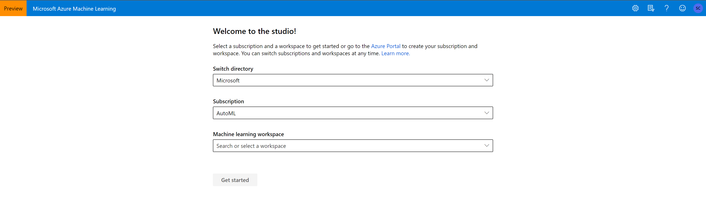
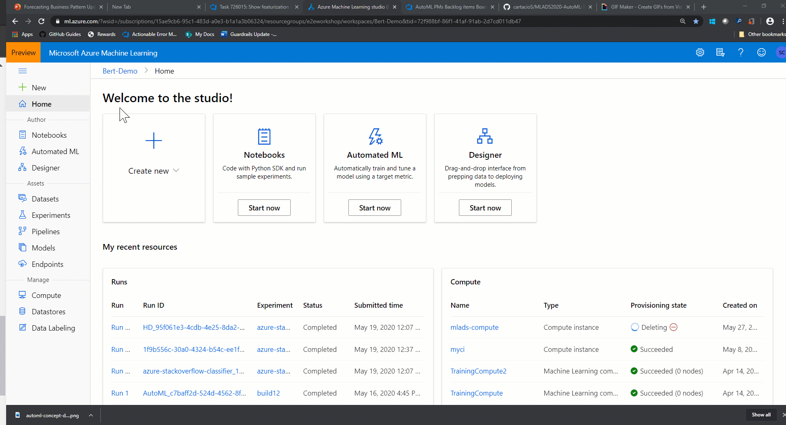
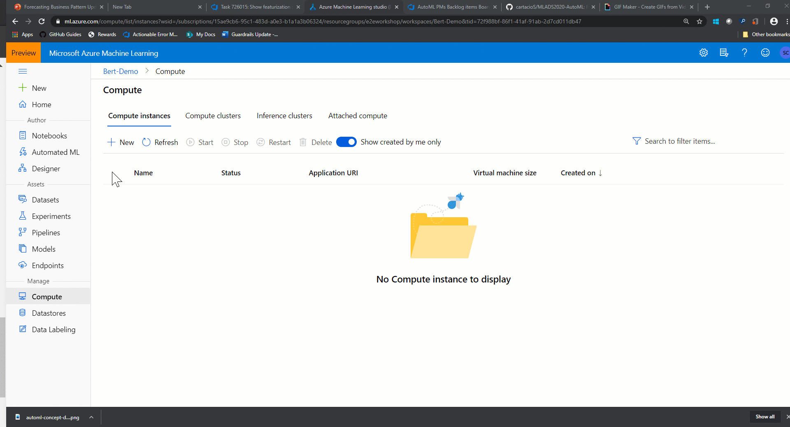
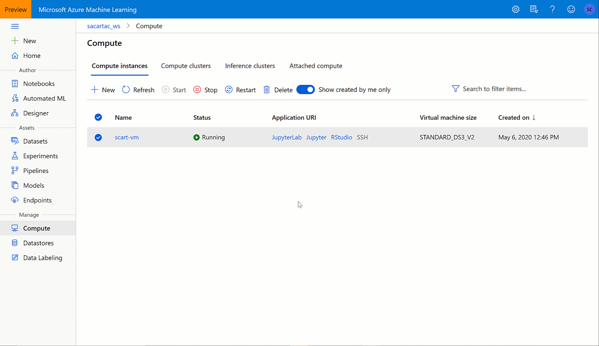
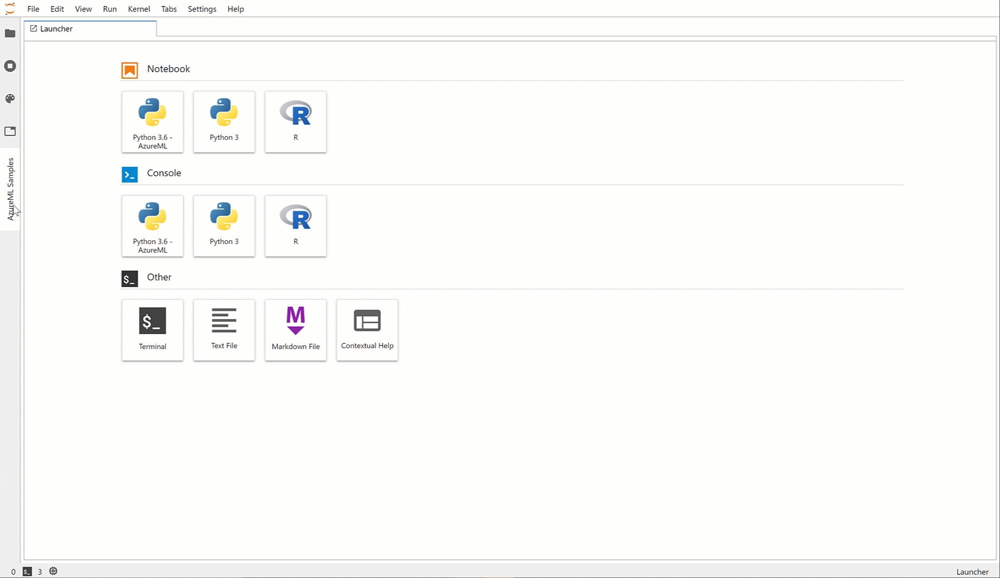

# MLADS 2020 LAB: Time-series Forecasting with Automated Machine Learning
The content below is a guide for a self-paced lab to understand time-series forecasting with Automated Machine Learning both through the Python code experience and UI no-code experience. We will walk through common forecasting parameters and considerations when working with time-series data.

# Key Words
- Time-series, Forecasting, Hyperparameter tuning, Python, JupyerLab, No-code UI

# Prerequisites
In order to successfully follow along with this lab, let's ensure you have an Azure Machine Learning workspace created.
* [Create a workspace](https://docs.microsoft.com/en-us/azure/machine-learning/tutorial-1st-experiment-sdk-setup#create-a-workspace)

# Lab agenda
* Introduction to automated ML
* The studio and model authoring experiences
* Creating a compute instance
* Running a python code automated ML experiment
* Understanding forecasting parameters and concepts
* Train, evaluate, and deploy your model
* Easily perform these steps again in a no-code experience

## Automated ML introduction
Automated machine learning (automated ML) builds high quality machine learning models for you by automating model and hyperparameter selection. Bring a labelled dataset that you want to build a model for, automated ML will give you a high quality machine learning model that you can use for predictions.

If you are new to Data Science, automated ML will help you get jumpstarted by simplifying machine learning model building. It abstracts you from needing to perform model selection, hyperparameter selection, or feature engineering and in one step creates a high quality trained model for you to use.

If you are an experienced data scientist, automated ML will help increase your productivity by intelligently performing the model and hyperparameter selection for your training and generates high quality models much quicker than manually specifying several combinations of the parameters and running training jobs. Automated ML provides visibility and access to all the training jobs and the performance characteristics of the models to help you further tune the pipeline if you desire.

## The studio and automated ML authoring experience
Azure ML has a suite of authoring experiences in a user-interface format in [the studio](https://ml.azure.com). 

1. Visit [https://ml.azure.com](https://ml.azure.com)
2. Select your `directory`, `subscription`, and `workspace`

Automated ML is supported by multiple execution environments including:
* Compute Instances
* Local Conda environment
* Azure Databricks

## Setup using compute instances
In this lab we will be focusing on the Compute Instance environment.

1. On the left hand panel under the `Manage` section, click on `Compute`

2. Click `+ New` to create a new compute. *It will take a couple minutes for this compute to to spin-up.*

3. When the compute `Status` is `Running`, select the `JupyertLab` Application URI.

## Forecasting overview

Time series forecasting is the process of predicting future outcomes based on historic information. Building forecasts is an integral part of any business, whether it’s revenue, inventory, sales, or customer demand.

Forecasting within automated machine learning (ML) now includes capabilities that improve the accuracy and performance of our recommended models:
* Forecast function
* Rolling-origin cross validation
* Configurable Lags
* Rolling window aggregate features
* Holiday featurization

In this lab 

## Run the lab on JupyterLab
In this part of the lab we will be covering a Python code example leveraging JupyterLab.

1. Launch the JupyterLab environment from your compute instance.

2. Select the AzureML Samples tab, then click into `How to use AzureML`/`Automated Machine Learning`/`Auto ML Forecasting Bike Share`. Select the `clone` button to clone this notebook.

3. Follow along with the notebook instructions to complete the code section of this lab.

## Run the lab with the AutoML UI
 
1. Return back to the studio home page [the studio](https://ml.azure.com)
2. On the left pane under `Author` select the `Automated ML` tab.

## Create and load dataset

Before you configure your experiment, upload your data file to your workspace in the form of an Azure Machine Learning dataset. Doing so, allows you to ensure that your data is formatted appropriately for your experiment.

1. On the **Select dataset** form, select **From local files** from the  **+Create dataset** drop-down. 

    1. On the **Basic info** form, give your dataset a name and provide an optional description. The dataset type  should default to **Tabular**, since automated ML in Azure Machine Learning studio currently only supports tabular datasets.
    
    1. Select **Next** on the bottom left

    1. On the **Datastore and file selection** form, select the default datastore that was automatically set up during your workspace creation, **workspaceblobstore (Azure Blob Storage)**. This is the storage location where you'll upload your data file. 

    1. Select **Browse**. 
    
    1. Choose the **bike-no.csv** file on your local computer. This is the file you downloaded as a [prerequisite](https://github.com/Azure/MachineLearningNotebooks/blob/master/how-to-use-azureml/automated-machine-learning/forecasting-bike-share/bike-no.csv).

    1. Select **Next**

       When the upload is complete, the Settings and preview form is pre-populated based on the file type. 
       
    1. Verify that the **Settings and preview** form is populated as follows and select **Next**.
        
        Field|Description| Value for tutorial
        ---|---|---
        File format|Defines the layout and type of data stored in a file.| Delimited
        Delimiter|One or more characters for specifying the boundary between&nbsp; separate, independent regions in plain text or other data streams. |Comma
        Encoding|Identifies what bit to character schema table to use to read your dataset.| UTF-8
        Column headers| Indicates how the headers of the dataset, if any, will be treated.| Use headers from the first file
        Skip rows | Indicates how many, if any, rows are skipped in the dataset.| None

    1. The **Schema** form allows for further configuration of your data for this experiment. 
    
        1. For this example, choose to ignore the **casual** and **registered** columns. These columns are a breakdown of the  **cnt** column so, therefore we don't include them.

        1. Also for this example, leave the defaults for the **Properties** and **Type**. 
        
        1. Select **Next**.

    1. On the **Confirm details** form, verify the information matches what was previously  populated on the **Basic info** and **Settings and preview** forms.

    1. Select **Create** to complete the creation of your dataset.

    1. Select your dataset once it appears in the list.

    1. Select  **Next**.

## Configure experiment run

After you load and configure your data, set up your remote compute target and select which column in your data you want to predict.

1. Populate the **Configure run** form as follows:
    1. Enter an experiment name: `automl-bikeshare`

    1. Select **cnt** as the target column, what you want to predict. This column indicates the number of total bike share rentals.

    1. Select **Create a new compute** and configure your compute target. Automated ML only supports Azure Machine Learning compute. 

        Field | Description | Value for tutorial
        ----|---|---
        Compute name |A unique name that identifies your compute context.|bike-compute
        Virtual&nbsp;machine&nbsp;size| Select the virtual machine size for your compute.|Standard_DS12_V2
        Min / Max nodes (in Advanced Settings)| To profile data, you must specify 1 or more nodes.|Min nodes: 1 Max nodes: 6
  
        1. Select **Create** to get the compute target. 

            **This takes a couple minutes to complete.** 

        1. After creation, select your new compute target from the drop-down list.

    1. Select **Next**.

## Select task type and settings

Complete the setup for your automated ML experiment by specifying the machine learning task type and configuration settings.

1. On the **Task type and settings** form, select **Time series forecasting** as the machine learning task type.

1. Select **date** as your **Time column** and leave **Group by column(s)** blank. 

    1. Select **View additional configuration settings** and populate the fields as follows. These settings are to better control the training job and specify settings for your forecast. Otherwise, defaults are applied based on experiment selection and data.

  
        Additional&nbsp;configurations|Description|Value&nbsp;for&nbsp;tutorial
        ------|---------|---
        Primary metric| Evaluation metric that the machine learning algorithm will be measured by.|Normalized root mean squared error
        Automatic featurization| Enables preprocessing. This includes automatic data cleansing, preparing, and transformation to generate synthetic features.| Enable
        Explain best model (preview)| Automatically shows explainability on the best model created by automated ML.| Enable
        Blocked algorithms | Algorithms you want to exclude from the training job| Extreme Random Trees
        Additional forecasting settings| These settings help improve the accuracy of your model    _**Forecast horizon**_: length of time into the future you want to predict   _**Forecast target lags:**_ how far back you want to construct the lags of a the target variable   _**Target rolling window**_: specifies the size of the rolling window over which features, such as the *max, min* and *sum*, will be generated. |Forecast horizon: 14   Forecast&nbsp;target&nbsp;lags: None   Target&nbsp;rolling&nbsp;window&nbsp;size: None
        Exit criterion| If a criteria is met, the training job is stopped. |Training&nbsp;job&nbsp;time (hours): 3   Metric&nbsp;score&nbsp;threshold: None
        Validation | Choose a cross-validation type and number of tests.|Validation type: &nbsp;k-fold&nbsp;cross-validation     Number of validations: 5
        Concurrency| The maximum number of parallel iterations executed per iteration| Max&nbsp;concurrent&nbsp;iterations: 6
        
        Select **Save**.

## Run experiment

To run your experiment, select **Finish**. The **Run details**  screen opens with the **Run status** at the top next to the run number. This status updates as the experiment progresses.

>[!IMPORTANT]
> Preparation takes **10-15 minutes** to prepare the experiment run.
> Once running, it takes **2-3 minutes more for each iteration**.     
> In production, you'd likely walk away for a bit as this process takes time. While you wait, we suggest you start exploring the tested algorithms on the **Models** tab as they complete. 

##  Explore models

Navigate to the **Models** tab to see the algorithms (models) tested. By default, the models are ordered by metric score as they complete. For this tutorial, the model that scores the highest based on the chosen **Normalized root mean squared error** metric is at the top of the list.

While you wait for all of the experiment models to finish, select the **Algorithm name** of a completed model to explore its performance details. 

The following example navigates through the **Model details** and the **Visualizations** tabs to view the selected model's properties, metrics and performance charts. 

## Deploy the model

Automated machine learning in Azure Machine Learning studio allows you to deploy the best model as a web service in a few steps. Deployment is the integration of the model so it can predict on new data and identify potential areas of opportunity. 

For this experiment, deployment to a web service means that the bike share company now has an iterative and scalable web solution for forecasting bike share rental demand. 

Once the run is complete, navigate back to the **Run detail** page and select the **Models** tab.

In this experiment context, **StackEnsemble** is considered the best model, based on the **Normalized root mean squared error** metric.  We deploy this model, but be advised, deployment takes about 20 minutes to complete. The deployment process entails several steps including registering the model, generating resources, and configuring them for the web service.

1. Select the **Deploy best model** button in the bottom-left corner.

1. Populate the **Deploy a model** pane as follows:

    Field| Value
    ----|----
    Deployment name| bikeshare-deploy
    Deployment description| bike share demand deployment
    Compute type | Select Azure Compute Instance (ACI)
    Enable authentication| Disable. 
    Use custom deployment assets| Disable. Disabling allows for the default driver file (scoring script) and environment file to be autogenerated. 
    
    For this example, we use the defaults provided in the *Advanced* menu. 

1. Select **Deploy**.  

    A green success message appears at the top of the **Run** screen stated that the deployment was started successfully. The progress of the deployment can be found  
    in the **Recommended model** pane under **Deploy status**.
    
Once deployment succeeds, you have an operational web service to generate predictions. 

Proceed to the [**Next steps**](#next-steps) to learn more about how to consume your new web service, and test your predictions using Power BI's built in Azure Machine Learning support.

## Clean up resources

Deployment files are larger than data and experiment files, so they cost more to store. Delete only the deployment files to minimize costs to your account, or if you want to keep your workspace and experiment files. Otherwise, delete the entire resource group, if you don't plan to use any of the files.  

### Delete the deployment instance

Delete just the deployment instance from the Azure Machine Learning studio, if you want to keep the resource group and workspace for other tutorials and exploration. 

1. Go to the [Azure Machine Learning studio](https://ml.azure.com/). Navigate to your workspace and  on the left under the **Assets** pane, select **Endpoints**. 

1. Select the deployment you want to delete and select **Delete**. 

1. Select **Proceed**.

### Delete the resource group

[!INCLUDE [aml-delete-resource-group](../../includes/aml-delete-resource-group.md)]

## Next steps

In this tutorial, you used automated ML in the Azure Machine Learning studio to create and deploy a time series forecasting model that predicts bike share rental demand. 

See this article for steps on how to create a Power BI supported schema to facilitate consumption of your newly deployed web service:

> [!div class="nextstepaction"]
> [Consume a web service](how-to-consume-web-service.md#consume-the-service-from-power-bi)

+ Learn more about [automated machine learning](concept-automated-ml.md).
+ For more information on classification metrics and charts, see the [Understand automated machine learning results](how-to-understand-automated-ml.md#classification) article.
+ Learn more about [featurization](how-to-configure-auto-features.md#featurization).
+ Learn more about [data profiling](how-to-use-automated-ml-for-ml-models.md#profile).

>[!NOTE]
> This bike share dataset has been modified for this tutorial. This dataset was made available as part of a [Kaggle competition](https://www.kaggle.com/c/bike-sharing-demand/data) and was originally available via [Capital Bikeshare](https://www.capitalbikeshare.com/system-data). It can also be found within the [UCI Machine Learning Database](http://archive.ics.uci.edu/ml/datasets/Bike+Sharing+Dataset).  
> Source: Fanaee-T, Hadi, and Gama, Joao, Event labeling combining ensemble detectors and background knowledge, Progress in Artificial Intelligence (2013): pp. 1-15, Springer Berlin Heidelberg.

